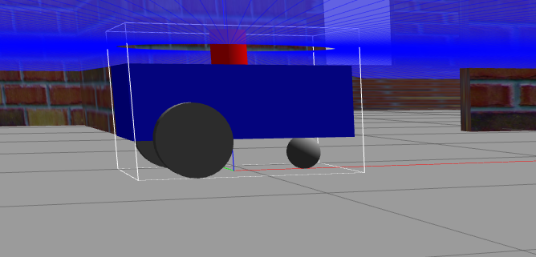
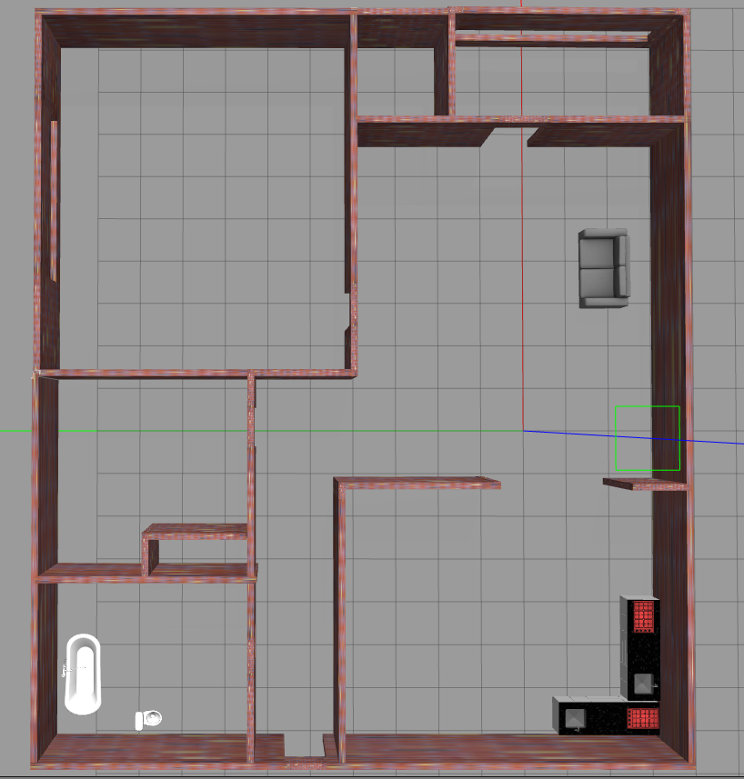

# Differential Drive Robot Simulation, Sensor Verification & Sensor Fusion

## Project Overview

This project implements and evaluates a differential drive robot in a simulated apartment-like environment using Gazebo and ROS 2.
The work is structured into three main tasks:

- Simulation & Sensor Verification
- Odometry Drift Analysis
- Sensor Fusion
## Q1. Simulation & Sensor Verification

- Robot Design:

    In this section a simple differential drive robot is built. Sensors like 2D Lidar, IMU and wheel odometry from diff-drive plugin(Gazebo) have been integrated.

    

- Environment:

    Apartment-style world in Gazebo with walls and furniture to represent static obstacles.

    


- Verification: 
    The following topics are being published and verified from rviz

    - /odom – wheel odometry

    - /scan – LiDAR scan


Deliverables
 
- URDF/SDF files: [Robot sdf file](https://github.com/SHARATHNPAYYADI/diff_drive_ws/tree/develop/src/diff_drive_robot_description/urdf)

- Launch files: [Bringup launch file](https://github.com/SHARATHNPAYYADI/diff_drive_ws/blob/develop/src/diff_drive_bringup/launch/bringup.launch.py)

- RViz screenshots: 

    

- TF Tree: [tf_tree](https://github.com/SHARATHNPAYYADI/diff_drive_ws/blob/develop/src/images/tf2_tree.pdf) 

- Design Considerations

    The sensor suite was chosen to balance localization accuracy, mapping capability, and computational cost. LiDAR provides robust obstacle perception  and wheel odometry provides local motion tracking.

## Q2. Odometry Drift Analysis
- Experiment

    Robot moved along the boundary of the environment (one complete loop).

- Recorded trajectories from:

    - Wheel Odometry (/odom)
    - Ground Truth (TF map → base_link / Gazebo)
    - Scan-based pose estimates

- Results

    Plotted all three trajectories in respective plots 
   

- Observations

    - Odometry drift observed → accumulates error over time (wheel slip, encoder noise).

    - Scan pose corrects drift but noisy.

    - Ground truth remains consistent as reference.

## Q3. Sensor Fusion
- Approach

    Implemented a simple custom Extended Kalman Filter (EKF) for fusing the sensors from sensors like:

    - Wheel odometry (position + velocity)
    - LiDAR-based scan pose correction

- Implementation

    - Custom ROS 2 package: diff_drive_localization

    - Node subscribes to /odom and /scan_pose.

    - Publishes fused estimate on /ekf_pose.

- Results

    Fused trajectory shows the reduce in the drift. But still the dependency on odom and scan pose need to be tuned further

- Final comparison plot: 
      

-  Discussion

    - EKF chosen because it handles non-linear system dynamics and sensor noise.

    - Improved localization accuracy observed, especially in long trajectories.

## Setup
This section gives the breif setup instruction

## How to Lauch

- To start the simulation to visualize the robot in simulatio we can use following launch file

    ```bash
    ros2 launch diff_drive_bringup bringup.launch.py
    ```

- To start the localization please start the following line in another terminal
    ```bash
    ros2 launch diff_drive_bringup ekf.launch.py
    ```